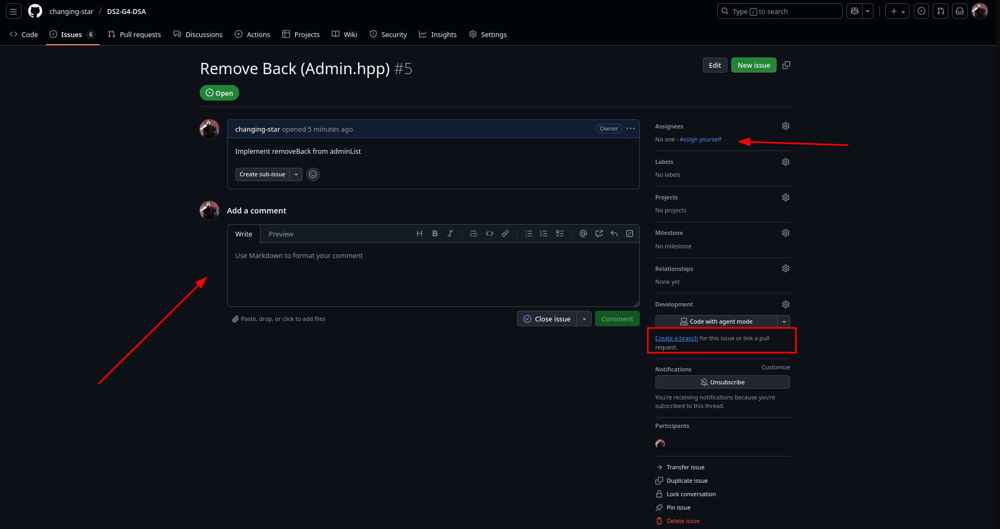
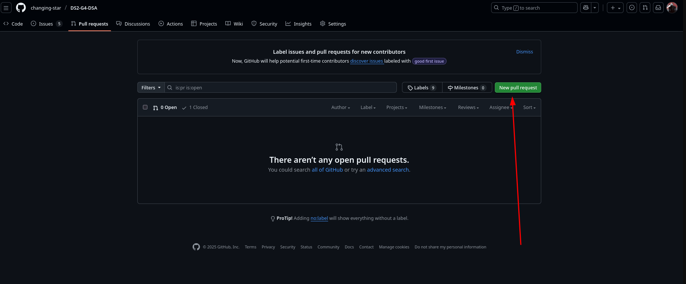

# Contributing

This is an example of how to pick up an issue

This is an example of how to create a pull request

## Conventional Commit Messages

PLEASE PLEASE PLEASE READ UP ON THIS

i have no idea how to stress this enough, but your commit messages need to be meaningful

thank you!

https://www.conventionalcommits.org/en/v1.0.0/